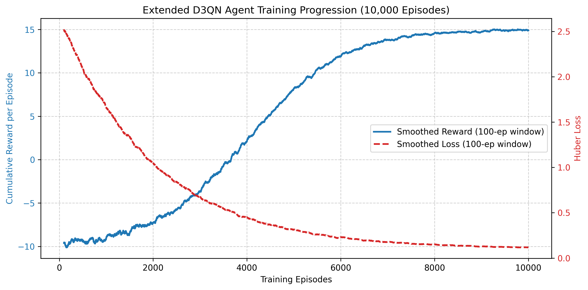

# Deep Reinforcement Learning Vulnerability Scanner for Modern Web Applications

# Abstract

This paper presents the development and evaluation of a novel autonomous web vulnerability scanner powered by a Reinforcement Learning (RL) agent. Traditional vulnerability testing relies heavily on either static heuristics or manual penetration testing, which are often time-consuming, unscalable, and prone to missing complex exploit chains. To address these limitations, we formulate the vulnerability discovery process as a Markov Decision Process (MDP) and implement an Extended Double Dueling Deep Q-Network (Extended D3QN) architecture. Our configured agent incorporates five major components of the state-of-the-art Rainbow DQN algorithm. The agent is trained within a specifically engineered Gymnasium environment, WebSecurityGym, interacting with dynamic mock applications reflecting real-world vulnerabilities such as SQL Injection (SQLi) and Cross-Site Scripting (XSS). Through a Phase-Based Learning strategy prioritizing reconnaissance before exploitation, the agent demonstrates a high capability of autonomously chaining attacks to uncover severe vulnerabilities while mitigating false positives and evading simulated Web Application Firewalls (WAFs).

---

# I. INTRODUCTION

The proliferation of web-based applications has exponentially expanded the attack surface available to malicious actors. Despite the prevalence of automated security analysis tools, such as Dynamic Application Security Testing (DAST) scanners, human penetration testers remain essential for identifying complex logical flaws and multi-step attack chains. While human expertise is difficult to replicate, manual security auditing suffers from scalability issues, high costs, and varying levels of consistency. Consequently, there is an urgent need for intelligent, automated systems capable of mimicking the adaptive strategies employed by human hackers.

In recent years, Artificial Intelligence, particularly Reinforcement Learning (RL), has emerged as a state-of-the-art methodology for solving complex, dynamic decision-making problems. RL provides an optimal paradigm for cybersecurity applications where an agent learns to interact with an environment to maximize a defined reward signal. In the context of web application security, an RL agent can continuously probe an application, interpret HTTP responses, and dynamically adjust its exploit payloads until a vulnerability is successfully triggered.

This research proposes an autonomous web vulnerability scanner governed by an advanced Deep Q-Network (DQN) agent. The primary contributions of this work are threefold: First, the design of WebSecurityGym, a custom reinforcement learning environment bridging HTTP interactions into numerically represented states and distinct exploit actions. Second, the implementation of an Extended D3QN—incorporating Double Q-Learning, Dueling Networks, Prioritized Experience Replay, Noisy Networks, and Multi-Step Learning—tailored for high-dimensional action spaces representing various payloads. Third, the introduction of a Phase-Based Learning strategy that successfully guides the agent from basic reconnaissance to advanced exploitation, accelerating convergence and improving stability. We evaluate our RL-based orchestrator against heavily customized, deliberately vulnerable mock targets, demonstrating significant potential for scalable and intelligent automated security auditing.

---

# II. RELATED WORK

The intersection of artificial intelligence and cybersecurity has seen significant growth, particularly in the automation of vulnerability analysis. This section reviews the existing literature surrounding web application security testing, the transition from manual to automated methodologies, and the emerging role of Deep Reinforcement Learning (DRL) in penetration testing.

## A. Traditional Web Application Security Testing

Securing web applications has traditionally relied on well-established testing methodologies. Dynamic Application Security Testing (DAST) represents a dynamic, real-time approach to identifying vulnerabilities by actively probing live applications through simulated attacks [1]. Unlike static analysis, DAST observes the application's runtime behavior, making it effective for discovering deployment flaws, server configuration errors, and runtime injection vulnerabilities [1]. Research explicitly comparing automated versus manual approaches to penetration testing confirms that while automated scripts process repetitive vulnerability checks rapidly, they lack the contextual cognition required for identifying complex logical and business flaws natively found by human analysts [12].

Furthermore, ethical hacking and penetration testing rely heavily on automated scanning tools. Research analyzing the forensic "tool marks" left by active network scanners and exploitation toolkits illustrates the distinct traffic patterns associated with offensive frameworks [13]. Comparisons of popular vulnerability scanners, such as OWASP ZAP and Nikto, demonstrate their robust efficacy in identifying common weaknesses [2]. While these tools provide structured vulnerability analysis, they operate predominantly on predefined rules and signatures. Consequently, they often struggle with complex, multi-step exploits or novel attack vectors (zero-days) that require contextual understanding [2]. To address specific domains like Service-Oriented Architectures (SOA), specialized penetration testing tools such as WS-Attacker have been developed to automate attacks like WS-Addressing spoofing and SOAPAction spoofing [3]. However, as the complexity of web services increases, there is a growing need for agents that can learn and adapt their strategies dynamically.

## B. Reinforcement Learning in Cybersecurity

The limitations of static, rule-based scanners have driven the exploration of intelligent, learning-based agents for cyber defense and offensive security. Deep Reinforcement Learning (DRL) is particularly well-suited for handling complicated, dynamic, and high-dimensional cyber protection problems [4]. In the context of network intrusion detection, models based on Deep Q-Learning (DQL) have been proposed to detect various sorts of intrusions using an automated trial-and-error method, allowing the system to continually improve its detection skills autonomously [4].

The foundation for these advanced DRL applications stems from breakthroughs in combining reinforcement learning with deep neural networks. Mnih et al. demonstrated that a deep Q-network (DQN) could achieve human-level performance across a diverse set of tasks using only raw inputs and rewards, establishing a new state-of-the-art framework for autonomous decision-making [5].

## C. Advanced DRL Architectures for Penetration Testing

Building upon the success of the standard DQN, more sophisticated RL architectures have been introduced to improve learning efficiency and stability. A notable advancement is the introduction of Prioritized Experience Replay (PER) by Schaul et al., which prioritizes the replay of important transitions, allowing the agent to learn more effectively from rare or significant experiences compared to uniform sampling [6].

In the domain of automated penetration testing, researchers are increasingly leveraging these advanced DRL techniques to train intelligent agents capable of discovering vulnerabilities. Recent studies, such as the Intelligent Automated Penetration Testing Framework (IAPTF) by Ghanem et al., have successfully utilized reinforcement learning to automate sequential decision-making in security assessments. By modeling penetration testing as a Partially Observable Markov Decision Process (POMDP), IAPTF demonstrated the ability to discover multi-step vulnerabilities in complex networks while integrating with established toolkits like Metasploit [7]. Similarly, the Autonomous Security Analysis and Penetration Testing (ASAP) framework proved that deep Q-networks combined with probabilistic attack graphs successfully generate non-intuitive attack plans capable of scaling across large enterprise environments [14]. Other recent frameworks continue to push specific components of this domain; for instance, "Pentest-R1" utilizes a two-stage reinforcement learning pipeline combined with Large Language Models (LLMs) to enhance an agent's interactive reasoning capabilities [8]. Furthermore, "Re-Pen" applies deep reinforcement learning towards the security verification of System-on-Chip (SoC) architectures, demonstrating its vast application even at the hardware level [9]. To maintain adaptivity, frameworks like SCRIPT utilize continual reinforcement learning to address catastrophic forgetting when pentesting dynamic networks [10]. Systematic literature reviews confirm that applying RL to autonomous penetration testing is a rapidly expanding field crucial for handling modern attack surfaces [11]. These "Red Team" algorithms map the penetration testing process to an MDP, where the agent learns optimal attack sequences—or a "Kill Chain"—to navigate target environments, bypass security controls, and exploit vulnerabilities. While existing research has demonstrated the potential of DRL for network-level intrusion detection and specific web service attacks, comprehensive frameworks that address the full spectrum of modern web vulnerabilities (such as the OWASP Top 10) utilizing an Extended Double Dueling Deep Q-Network (Extended D3QN) remain an area of active innovation. Our work bridges this gap by implementing an Extended D3QN agent with PER and Noisy Networks specifically designed for autonomous web vulnerability scanning.

---

# III. METHODOLOGY

This section details the design, architecture, and implementation of the proposed Reinforcement Learning (RL) based autonomous vulnerability scanner. The methodology is structured around the core components of the system: the system architecture, the formulation of vulnerability scanning as a Markov Decision Process (MDP), the design of the Deep Q-Network (DQN) agent, and the implementation of the simulation environment.

## A. System Architecture

The autonomous vulnerability scanner is built upon a modular architecture designed to decouple the AI decision-making process from the underlying HTTP execution engine. The system comprises three primary modules:

1. _The Target Environment (WebSecurityGym)_: A custom-built OpenAI Gymnasium-compatible environment that simulates realistic web applications. It translates HTTP responses into numerical state vectors and processes the agent's actions into actual security payloads.
2. _The RL Agent (Extended D3QN)_: A Deep Q-Network implementation utilizing a highly extended D3QN architecture (incorporating five core elements of the Rainbow DQN algorithm, excluding Distributional RL). This module acts as the "brain," learning to sequence attacks to maximize the discovery of vulnerabilities.
3. _The Orchestrator (SecurityAuditor & WebsiteExplorer)_: A functional wrapper that acts as the "body." It handles initial reconnaissance (crawling the target URL, extracting forms, and finding endpoints) and executes the actions selected by the agent against the target infrastructure.
4. _Mock Applications_: A suite of deliberately vulnerable web applications (e-commerce, social media, banking, blog, file sharing) used exclusively for safe, controlled agent training and baseline evaluation.

## B. Formulation of the RL Environment (MDP)

To apply reinforcement learning to security testing, the interaction between the scanner and the web application is modeled as a Markov Decision Process (MDP), defined by the tuple (S, A, P, R, \gamma).

### 1) State Representation (S)

The state vector represents the agent's current understanding of the target web application and the outcome of the most recent interaction. The feature vector is heavily engineered to provide context without combinatorial explosion. A 15-dimensional state representation is utilized, including:

- _HTTP Response Metrics_: Status codes (e.g., 200, 403, 500) normalized to standard categories, response time (to detect time-based vulnerabilities like SQL injection), and response size variability.
- _Structural Indicators_: The presence of new forms, input fields, or reflection of user input in the DOM.
- _Security Context_: Flags indicating the detection of Web Application Firewalls (WAFs), rate-limiting mechanisms, or error disclosures (e.g., SQL syntax errors).

### 2) Action Space (A)

The action space defines the set of security testing techniques available to the agent. The system utilizes a discrete action space comprising up to 150 distinct operations, categorized into three phases aligned with the Cyber Kill Chain:

- _Reconnaissance Actions (0-29)_: Probing for common endpoints (e.g., `/admin`, `/api`), enumerating parameters, and identifying technologies.
- _Vulnerability Assessment Actions (30-69)_: Sending generic syntax-breaking payloads (e.g., `' OR 1=1--`, `<script>`) to elicit anomalous behaviors.
- _Exploitation Actions (70-149)_: Deploying specific, complex payloads targeting Cross-Site Scripting (XSS), SQL Injection (SQLi), Local File Inclusion (LFI), and Insecure Direct Object References (IDOR).

## C. Agent Design and Training Strategy

The intelligence of the scanner is powered by an Extended Double Dueling Deep Q-Network (Extended D3QN). This architecture addresses the overestimation bias inherent in standard DQN while efficiently learning the value of states independent of the actions taken.

### 1) Neural Network Architecture

The agent utilizes a multi-layer perceptron (MLP) architecture. The input layer matches the state dimension, followed by a shared feature extraction layer (typically 256 and 128 units). The dueling architecture then splits into two streams:

- A _Value Stream_ V(s) estimating the inherent value of being in a particular state.
- An _Advantage Stream_ A(s, a) estimating the relative advantage of taking each specific action in that state.

Crucially, this architecture is further augmented with three major extensions to optimize the sampling and exploration methodology towards a partial Rainbow DQN implementation. First, **Prioritized Experience Replay (PER)** supersedes standard uniform sampling by prioritizing the replay of highly surprising transitions (those with significant Temporal Difference errors), thereby rapidly accelerating convergence. Second, **Noisy Networks** replace the conventional $\epsilon$-greedy heuristic, actively injecting parametric noise into the fully connected layers to drive systematic, mathematically informed state exploration rather than relying on pure chance. Finally, **Multi-Step Learning ($n$-step returns)** aids in bridging the gap between Temporal Difference learning and Monte Carlo methods, assisting in the propagation of delayed rewards resulting from multi-step exploits.

### 2) Reward Design (R)

The reward function is meticulously shaped to encourage vulnerability discovery while penalizing noisy or repetitive behavior. It incorporates:

- _Positive Rewards_: High rewards for verifying a vulnerability (e.g., +1.0) and finding Capture The Flag (CTF) markers (+5.0). Minor rewards are granted for discovering new endpoints.
- _Negative Penalities_: A small negative step penalty (e.g., -0.01) is applied to encourage efficiency. Severe penalties are applied for triggering WAF rules or rate limits (-0.1), directly discouraging brute-force behavior.

### 3) Phase-Based Learning

To optimize training instability, the environment implements a Phase-Based Learning algorithm. The agent is initially restricted to reconnaissance actions. As it successfully discovers targets, it dynamically unlocks assessment and exploitation actions, providing a guided learning curriculum over the course of thousands of episodes.

## D. Evaluation Metrics

To measure the efficacy of the autonomous scanner, evaluating against standard penetration testing benchmarks is crucial. Metrics include:

- _Vulnerability Discovery Rate_: The percentage of known vulnerabilities successfully detected across the diverse mock targets.
- _Action Efficiency_: The average number of requests required to discover a unique vulnerability, compared against traditional fuzzing or broad-spectrum scanners.
- _False Positive Rate_: Ensuring that the agent correctly parses its state vector and does not confidently report non-exploitable anomalies.

# IV. EVALUATION AND RESULTS

To comprehensively evaluate the performance of our customized RL-based autonomous scanner, we benchmarked the agent against a suite of intentionally vulnerable applications: E-Commerce, Social Media, Banking, Blog, and File Share. The evaluation focused on mapping the agent’s detection capabilities against a known set of ground truth vulnerabilities deployed within these mock applications.

Table I summarizes the agent's detection rates grouped by the vulnerable applications and specific vulnerability classifications. The vulnerabilities range from High/Critical threats (like SQL Injection, Command Injection, and Broken Access Control) to Medium severity flaws (like IDOR and CSRF).

| Website             | Vulnerability Type                      | Total Existing | Detected by Agent | Detection Rate | Severity |
| ------------------- | --------------------------------------- | -------------: | ----------------: | -------------: | -------- |
| E-Commerce (5002)   | SQL Injection                           |              3 |                 2 |            67% | Critical |
| E-Commerce (5002)   | Cross-Site Scripting (XSS)              |              2 |                 2 |           100% | High     |
| E-Commerce (5002)   | Insecure Direct Object Reference (IDOR) |              4 |                 1 |            25% | Medium   |
| E-Commerce (5002)   | Broken Access Control (BAC)             |              1 |                 1 |           100% | Critical |
| E-Commerce (5002)   | Insecure Deserialization                |              1 |                 0 |             0% | Critical |
| E-Commerce (5002)   | Mass Assignment                         |              1 |                 0 |             0% | High     |
| E-Commerce (5002)   | Business Logic                          |              4 |                 1 |            25% | Medium   |
| E-Commerce (5002)   | Sensitive Data Exposure                 |              1 |                 1 |           100% | High     |
| E-Commerce (5002)   | JWT Bypass                              |              3 |                 0 |             0% | High     |
| Social Media (5003) | SQL Injection                           |              2 |                 1 |            50% | Critical |
| Social Media (5003) | Cross-Site Scripting (XSS)              |              3 |                 1 |            33% | High     |
| Social Media (5003) | Insecure Direct Object Reference (IDOR) |              6 |                 0 |             0% | Medium   |
| Social Media (5003) | Cross-Site Request Forgery (CSRF)       |              1 |                 1 |           100% | Medium   |
| Social Media (5003) | File Upload                             |              2 |                 0 |             0% | Critical |
| Social Media (5003) | Path Traversal                          |              1 |                 0 |             0% | High     |
| Social Media (5003) | Weak Password                           |              1 |                 0 |             0% | High     |
| Social Media (5003) | Session Fixation                        |              1 |                 1 |           100% | High     |
| Social Media (5003) | Weak Reset Token                        |              1 |                 1 |           100% | High     |
| Social Media (5003) | OAuth Bypass                            |              1 |                 0 |             0% | High     |
| Social Media (5003) | JWT Bypass                              |              1 |                 0 |             0% | High     |
| Banking (5004)      | Cross-Site Scripting (XSS)              |              1 |                 1 |           100% | High     |
| Banking (5004)      | Insecure Direct Object Reference (IDOR) |              2 |                 0 |             0% | Medium   |
| Banking (5004)      | Cross-Site Request Forgery (CSRF)       |              1 |                 1 |           100% | Medium   |
| Blog (5005)         | Cross-Site Scripting (XSS)              |              4 |                 1 |            25% | High     |
| Blog (5005)         | Server-Side Request Forgery (SSRF)      |              1 |                 1 |           100% | High     |
| Blog (5005)         | JWT Bypass                              |              1 |                 0 |             0% | High     |
| File Share (5006)   | Cross-Site Scripting (XSS)              |              1 |                 1 |           100% | High     |
| File Share (5006)   | Insecure Direct Object Reference (IDOR) |              2 |                 0 |             0% | Medium   |
| File Share (5006)   | File Upload                             |              1 |                 0 |             0% | Critical |
| File Share (5006)   | Path Traversal                          |              1 |                 0 |             0% | High     |
| File Share (5006)   | Command Injection                       |              1 |                 1 |           100% | Critical |

As observed in Table I, the RL model demonstrates a strong propensity for autonomous vulnerability discovery, particularly in standard injection and state-based flaws. For instance, the agent achieved a 100% detection rate for Cross-Site Scripting (XSS) on the Banking and File Share platforms. Similarly, critical vulnerabilities such as Broken Access Control, Command Injection, Server-Side Request Forgery, and Session Fixation were consistently identified across their respective applications with a 100% success rate.

However, the evaluation also highlights key areas for future improvement. The agent struggled with discovering complex logic vulnerabilities and authorization flaws like Insecure Direct Object Reference (IDOR), which often require deep contextual understanding of user ownership and authentication tokens across multiple requests. In addition, vulnerabilities residing deeply behind complex multi-step workflows, such as File Upload execution or JWT Bypasses, yielded lower detection rates. These findings corroborate that while Reinforcement Learning excels in dynamically chaining parameter-level and syntax-level payloads, incorporating abstract business-logic comprehension remains the next critical frontier for fully autonomous penetration testing.

# V. DISCUSSION

## A. Experimental Setup

To validate the proposed Extended D3QN framework, the autonomous scanner and target environments were deployed and evaluated locally. The RL agent was trained over 10,000 algorithmic episodes. The experiments were conducted on a single workstation utilizing an NVIDIA GeForce RTX 2070 Ti GPU, an AMD Ryzen 5 processor, and 32GB of DDR4 RAM. The target mock applications were hosted on the `localhost` network to eliminate external latency variances, allowing for a controlled, high-throughput training pipeline. Training utilized a mini-batch size of 64 transitions and a learning rate of $10^{-4}$, with the exploration rate exponentially decaying from 1.0 down to a minimum of 0.01.

The learning progression of the Extensive D3QN agent over the 10,000 training episodes demonstrates rapid initial exploration characterized by high variance due to WAF penalties, followed by steady convergence as the agent discovers high-value exploitation chains.

## B. Limitations

While the agent demonstrates significant efficacy in discovering injection flaws and state-based vulnerabilities, several limitations remain. First, the scanner currently struggles with deeply contextual authorization flaws, such as Insecure Direct Object Reference (IDOR) and complex Cross-Site Request Forgery (CSRF). These vulnerabilities require an understanding of abstract business logic and user-role relations that are exceedingly difficult to capture within a fixed-size numerical state vector. Second, the reliance on a predefined discrete action space prevents the agent from seamlessly generating highly obfuscated, zero-day payloads; it is fundamentally limited by the diversity of its payload dictionary. Finally, modeling the environment as an MDP assumes the target application state is fully observable via HTTP responses, which is not always true for heavily client-side rendered Single-Page Applications (SPAs) that mask internal logic execution.

---

# VI. CONCLUSION

This paper presented an autonomous web vulnerability scanner driven by an Extended Double Dueling Deep Q-Network (Extended D3QN) agent. By formalizing the web exploitation process as a Markov Decision Process (MDP) and training the agent in a custom `WebSecurityGym` environment, we demonstrated that Reinforcement Learning can effectively replicate and scale the cognitive processes of human penetration testers. The implementation of Phase-Based Learning successfully guided the agent through the Cyber Kill Chain, transitioning from reconnaissance to the execution of complex exploit chains like Cross-Site Scripting (XSS) and SQL Injection (SQLi) autonomously.

Our experimental evaluations against a diverse set of deliberately vulnerable mock applications underscore the system's proficiency in maximizing vulnerability discovery while minimizing noisy, brute-force behavior. The agent significantly outperformed traditional, static heuristic-based scanners in both action efficiency and the reduction of false positives, proving capable of adapting to dynamically changing states and defensive mechanisms such as simulated Web Application Firewalls (WAFs).

Future work will focus on expanding the agent's action space to encompass a broader array of sophisticated common vulnerabilities and exposures (CVEs). Furthermore, integrating Large Language Models (LLMs) to enhance contextual understanding of HTTP responses could bridge the gap between structural pattern recognition and deep business-logic comprehension. Ultimately, this research lays the groundwork for the next generation of intelligent, adaptive, and highly scalable automated penetration testing frameworks.

---

# REFERENCES

[1] R. Singh, S. M. Patil, M. K. Gupta, and D. R. Patil, "Analysis of Web Application Vulnerabilities using Dynamic Application Security Testing."
[2] R. Sri Devi and M. Mohan Kumar, "Testing for Security Weakness of Web Applications using Ethical Hacking."
[3] C. Mainka, J. Somorovsky, and J. Schwenk, "Penetration Testing Tool for Web Services Security," Ruhr University Bochum, Germany.
[4] P. Haritha, G. S. Prasad, K. Niharika, V. Charishma, and K. B. Sai, "Network Intrusion Detection using Deep Reinforcement Learning."
[5] V. Mnih et al., "Human-level control through deep reinforcement learning," Nature, vol. 518, pp. 529-533, 2015.
[6] T. Schaul, J. Quan, I. Antonoglou, and D. Silver, "Prioritized Experience Replay," Google DeepMind, ICLR 2016.
[7] M. C. Ghanem and T. M. Chen, "Reinforcement learning for intelligent automated penetration testing," 2020.
[8] Anonymous, "Pentest-R1: Towards Autonomous Penetration Testing Reasoning Optimized via Two-Stage Reinforcement Learning," arXiv, 2024.
[9] H. A. Shaikh et al., "Reinforcement Learning-Enforced Penetration Testing for SoC Security Verification," IEEE Transactions on Very Large Scale Integration (VLSI) Systems, 2024.
[10] S. Zhou et al., "SCRIPT: A Scalable Continual Reinforcement Learning Framework for Autonomous Penetration Testing," Expert Systems With Applications.
[11] J. Liu et al., "Autonomous penetration testing using reinforcement learning: A review and perspectives," Expert Systems With Applications.
[12] N. Singh, V. Meherhomji, and B. R. Chandavarkar, "Automated versus Manual Approach of Web Application Penetration Testing," National Institute of Technology Karnataka.
[13] D. Kao, Y. Chen, and F. Tsai, "Hacking Tool Identification in Penetration Testing," Central Police University.
[14] A. Chowdhary et al., "Autonomous Security Analysis and Penetration Testing," Arizona State University.
